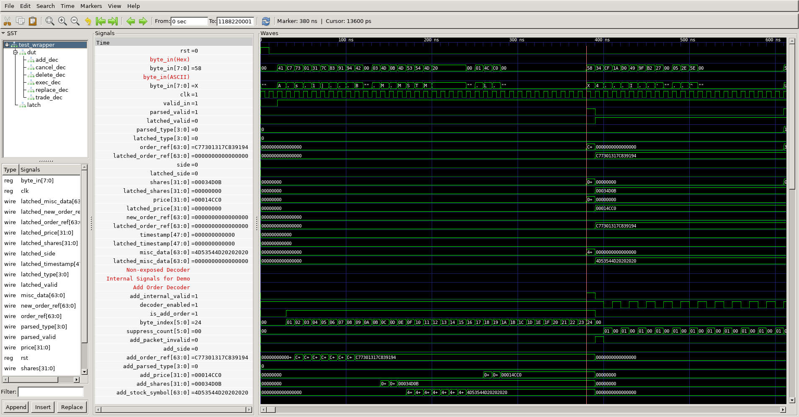
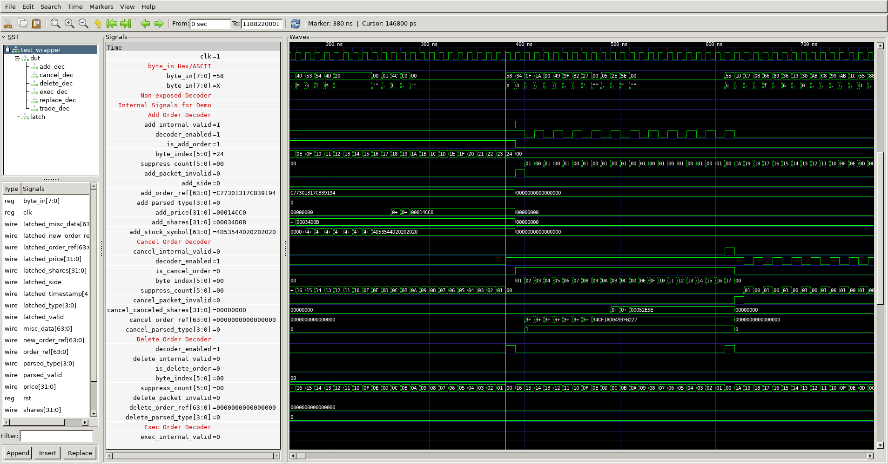
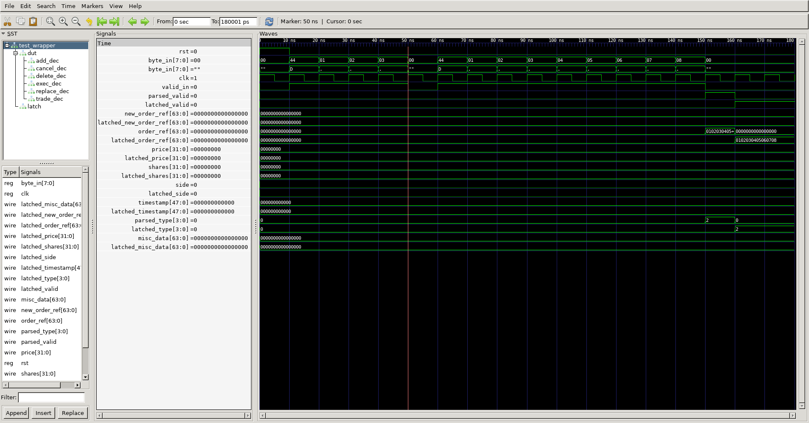

# Speculative ITCH Parser

## Overview

This project implements a speculative, low-latency ITCH message parser with a robust, gated architecture that achieves canonical-format output with only **one clock cycle of parsing delay**. All message types are parsed in parallel using a fully macro-driven RTL structure, enabling aggressive pipelining and precise control.

The RTL modules are highly modular and reusable, with suppression logic, mid-packet recovery, and arbitration implemented through well-isolated macros. A matching Cocotb testbench framework—also macroized and helper-driven—provides full-cycle logging, field-level validation, and protocol-level benchmarking.

Thanks to this flexible and structured design, the parser architecture can be trivially adapted to support other streaming protocols with raw serial input and canonical parallel output—such as market data feeds, trading logic interfaces, or packetized control streams.


---

## Project Structure

- [`rtl/`](Design/rtl/)
  - [`macros/`](Design/rtl/macros/)
    - [`field_macros/`](Design/rtl/macros/field_macros/)
      - ITCH field declarations (e.g., `itch_fields_add.vh`)
      - [README_field_macros.md](Design/rtl/macros/field_macros/README_field_macros.md)
    - Shared control macros (`itch_reset.vh`, `itch_core_decode.vh`, etc.)
    - [README_macros.md](Design/rtl/macros/README_macros.md)
  - [`modules/`](Design/rtl/modules/)
    - Individual ITCH message decoders (`*_order_decoder.v`)
    - [README_decoders.md](Design/rtl/modules/README_decoders.md)
  - Parser integration files (`parser.v`, `parser_latch_stage.v`, etc.)
  - [README_core_logic.md](Design/rtl/README_core_logic.md)

- [`sim/`](Design/sim/)
  - [`helpers/`](Design/sim/helpers/)
    - Simulation drivers, workload generators, and recorders
    - [README_helpers.md](Design/sim/helpers/README_helpers.md)
  - [`vcd`](Design/sim/vcd)
    - Waveform files and pictures
  - Cocotb testbenches (`test_integrated.py`, `test_parser_canonical.py`, `test_valid_drop_abort.py`)
  - Output logs and waveform automation (e.g., `recorded_log.csv`, `Makefile`)
  - [README_testbench.md](Design/sim/README_testbench.md)

- [README.md](README.md) 

Waveform Segment


Back-to-Back Detail


Mid-Packet Valid Drop Detail



## Architecture Summary

### Core RTL Files

- `*_order_decoder.v`: One decoder per ITCH message type (Add, Cancel, Delete, Replace, Executed, Trade)
- `parser.v`: Combinational arbitration logic that selects a valid decoder output
- `parser_latch_stage.v`: Optional pipeline register to stabilize downstream sampling
- `itch_*.vh`: Macro libraries for decoding logic, suppression, reset, and validity handling
- `rtl/signal_definitions/`: Decoder-specific field definitions for modular wiring

---

## Top-Level Parser Behavior (`parser.v`)

### Overview

- Each decoder asserts its own `*_internal_valid` when a message of its type is fully decoded
- The parser checks that exactly one decoder is active using a one-hot validation condition
- If exactly one decoder is active, its parsed fields are routed to the canonical output ports

### One-Hot Valid Check

- The one-hot condition is evaluated using internal signals from each decoder
- This check is done fully in parallel, with no added latency

### Arbitration Pseudocode

```verilog
always_comb begin
    parsed_valid = 1'b0;
    parsed_type  = 4'd0;
    ... // zero other outputs

    // Count active decoders
    valid_count = add_internal_valid + cancel_internal_valid +
                  delete_internal_valid + replace_internal_valid +
                  exec_internal_valid + trade_internal_valid;

    // Assert parsed_valid only if exactly one decoder fires
    if (valid_in && valid_count == 1) begin
        parsed_valid = 1'b1;

        if (add_internal_valid) begin
            parsed_type  = add_parsed_type;
            order_ref    = add_order_ref;
            ...
        end else if (cancel_internal_valid) begin
            ...
        end
        ...
    end
end
```

---

## Decoder Logic (All `*_decoder.v`)

### Shared Speculative Structure

- All decoders begin speculative parsing from cycle 0
- The first byte (`byte_in`) is always inspected, regardless of message type
- If it matches the expected type (`'A'`, `'X'`, etc.), decoding continues
- If not, suppression logic activates using `ITCH_LEN(byte_in)` to skip N cycles

### Parallel Suppression Logic

- The suppression counter is initialized in parallel across all decoders
- This eliminates idle cycles and ensures no latency is added when skipping mismatched messages

### Decoder Pseudocode (e.g., Add Order Decoder)

```verilog
always_ff @(posedge clk) begin
    if (rst) begin
        ITCH_RESET_FIELDS();
    end else if (valid_in) begin
        if (suppress_count > 0) begin
            suppress_count <= suppress_count - 1;
        end else begin
            case (byte_count)
                0: begin
                    if (byte_in == "A") begin
                        // Start decoding this message type
                        order_ref[63:56] <= byte_in;
                    end else begin
                        // Not our type; suppress future decode
                        suppress_count <= ITCH_LEN(byte_in);
                    end
                end
                1:  order_ref[55:48] <= byte_in;
                ...
                35: begin
                    ITCH_SET_VALID();        // Raise internal_valid
                    parsed_type <= 4'd1;     // 'A' = 1
                end
            endcase
        end
    end
end
```

---

## Timing Behavior

### Canonical Output Delay

- For an N-byte message injected starting at cycle 0:
  - The last byte arrives at cycle N−1
  - The decoder completes at cycle N
  - The parser outputs canonical data at cycle N+1
- This results in only 1 cycle of parsing delay

---

## Key Features

### Speculative Decoding

- All decoders speculatively parse the first byte
- Parsing proceeds immediately without waiting for message boundaries
- Reduces initial decode latency to zero

### Parallel Suppression Logic

- Each decoder autonomously computes suppression count on mismatch
- Suppression is applied in parallel and is zero-latency

### Back-to-Back Message Support

- The parser supports uninterrupted message streams
- No idle cycles or reset required between packets

### Mid-Packet Abort Handling

- If `valid_in` drops mid-message, all active decoders abort cleanly
- Parsing resumes immediately when `valid_in` rises again, with no state corruption

### Canonical Output Format

- The parser outputs a standardized signal set including:
  - `parsed_valid` (1 cycle pulse)
  - `parsed_type` (4-bit message ID)
  - `order_ref`, `shares`, `price`, etc. (depending on message type)

---

## Verification and Testing

- Exhaustive testbench using cocotb
- All ITCH message types validated with:
  - Random values in all fields
  - Permuted sequences and back-to-back messages
- Automated `Makefile`:
  - Builds and runs the simulation
  - Dumps `vcd` waveform and auto-opens GTKWave
- Latching logic (`parser_latch_stage.v`) verified separately

---

## Design Philosophy and Structure

### Modular RTL

- Shared macros handle FSM structure, resets, and suppression
- Decoder field declarations are separated into `rtl/signal_definitions/` for clean code

### Modular Testbench

- Stimulus generation and validation are built on reusable Python helpers
- Logs both signal traces and cycle-aligned decoded outputs to CSV

### Documentation

- Every module includes a title block with:
  - Description, Author, Start Date, Version
  - Detailed changelog entries

## License

This repository is publicly viewable for academic and demonstration purposes only.

All rights are reserved by the author. Reproduction, modification, or redistribution of the source code is not permitted without explicit written consent.
